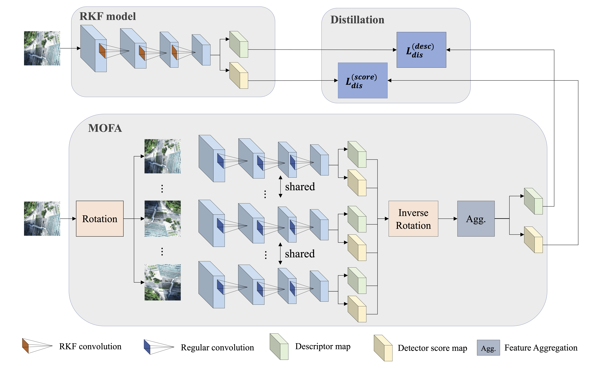

# DRKF: Distilled Rotated Kernel Fusion for Efficient Rotation Invariant Descriptors in Local Feature Matching
This repository contains the official Pytorch implementation of IROS 2023 Paper: **DRKF: Distilled Rotated Kernel Fusion for Efficient Rotation Invariant Descriptors in Local Feature Matching**

Code and data will come soon! 

## Framework

## Performance on DiverseBEV
Due to the lack of publicly available aerial-view datasets with high viewpoint changes and camera rotations, we also introduce a new dataset called DiverseBEV. 

This dataset comprises bird's eye view outdoor scenarios captured during the drone's fight, thus exhibiting large or even extreme rotation variations. For more details of this dataset, please refer to our paper.

|  Methods | Train Aug  |MAA(10◦&10m) | MAA(10◦)| MAA(10m) |
|  ----  | ----  |  ----  | ----  | ----  | 
|SIFT | – |0.3096 |0.5741 |0.3103|
|SuperPoint + SuperGlue| &#10003;  |0.1388| 0.2574| 0.1428|
|D2-Net |&#10005;  |0.0319| 0.0807 |0.0331|
|ASLFeat| &#10005; | 0.0789 |0.1548| 0.0809|
|LoFTR  |&#10005;  |0.0583| 0.1226| 0.0592|
|GIFT | &#10003;| 0.1200| 0.2410| 0.1216|
|RoRD |&#10003; |0.1833 |0.5110| 0.1848|
|(Ours) DRKF |&#10003;| 0.3914| 0.7523| 0.3966|
